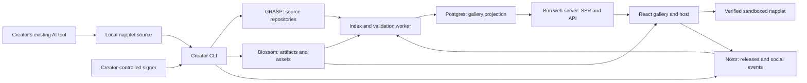

# napplet.space — proposed v1 plan

**Historical design; see [README.md](README.md) and feature documents for current behavior.**
This document preserves the original proposal and dated decisions. Statements below
that indexing, naming, publication, remix or deployment are still pending are
historical. The site is live with CLI 0.4.1; native PM2 services and SQLite replaced
the initial Compose/Postgres proposal. Use the README and linked implementation
documents for current status. The new requests cover source browsing, immersive
entry, signers/profiles, onboarding/curation/promotions, media/comments, NAP-CONFIG
and generalized ContextVM sessions; see the [upstream review](docs/NAP-REVIEW.md).

2026-09-13 infrastructure update: the [managed relay](docs/RELAY.md), [Blossom storage](docs/BLOSSOM.md), and [ngit-grasp source hosting](docs/GRASP.md) now run natively under PM2 locally and in the VPS deployment definition. This revises the original Compose/upstream-blob-server recommendation below: Blossom currently uses a bounded Bun implementation with shared Applesauce signing, explicit ownership/durable commit handling and protocol/process tests. We own its maintenance and conformance checks. The GRASP component now includes signed source pushes, independent clones and idempotent local repository seeds. Creator identity now includes OS-backed keys, NIP-46 bunker connections and encrypted recovery; the resumable single-HTML publisher now joins those services and returns relay publication evidence; persistent website indexing/naming is next; no VPS deployment is claimed.

2026-09-12 design follow-up: [CLIENT-DIRECTION.md](docs/CLIENT-DIRECTION.md) records the proposed Khatru/LMDB/Bleve relay, screenshot/video strategy, selectable flavor napplets, browser loading options, and concrete conformance gaps. The user explicitly selects the NIP-5D proposal as authoritative. Fix known host/CLI contract gaps before extending publication. Layout flavors are a future addition; ordinary creations remain self-contained.

2026-09-12 implementation additions: automatic idempotent development seeds, explicit relay-only `publicdev`, server-rendered OG/PNG previews, and a ContextVM matchmaking starter. Details and remaining boundaries: [public development](docs/PUBLIC-DEVELOPMENT.md), [ContextVM API/design](docs/CONTEXTVM.md). Creator-hosted ContextVMs are supported as a design direction; managed server-code hosting is deferred.

Status: v1 plan with initial implementation, 2026-09-11. The first web/runtime/local-CLI slice exists; the complete publish/remix platform is still planned. See [README.md](README.md) for working commands and [DEPLOYMENT.md](docs/DEPLOYMENT.md) for Caddy/PM2 deployment. The broader service URLs and workflows below remain the target architecture.

Build a place where someone discovers a tiny playable creation, remixes it with their own AI coding tool, and shares a working link minutes later. The product should celebrate experiments, jokes, games, and their creative ancestry. A successful visit can be thirty seconds of playing or an afternoon of making.

The architectural recommendation is a Bun/React gallery and napplet host, a thin creator CLI around existing napplet/ngit tools, and operator-provided Nostr, GRASP, and Blossom services. Creators own the signing identity and source. Services provide useful defaults and can be replaced.

## 1. Scope and working decisions

Confirmed by the user:

- Browse other people's napplets, play fullscreen, comment, like, and zap.
- Open source by default, with inspection and remixing central to the experience.
- Self-contained napplets; cross-napplet composition is outside v1.
- Operator-provided Git and asset hosting, with configuration that works immediately.
- Creators use their existing AI coding tool. An online AI IDE comes later.
- Bun/React is the preferred web stack.
- Use shadcn/ui for the website's UI components.
- Use Applesauce for Nostr integration.
- Provide a simple VPS deploy script including Caddy and PM2. Run our Bun server under PM2; keep external service provisioning explicit as those integrations are implemented.
- Platform development must run the same service implementations as production, with a convenient startup workflow and close behavioral parity.
- Napplets need readable named routes alongside portable Nostr-address routes.

Recommended defaults, still open to discussion:

- Anonymous browsing and playing. An identity is needed when publishing social actions or releases.
- One reusable creator identity, with optional existing signer connection; one repository per napplet.
- Local creation first; public Git repository provisioning happens at first publish. Abandoned experiments stay local.
- A single HTML runtime artifact with code, fonts, textures, and audio embedded. Start with a 10 MiB uncompressed artifact ceiling and a 5 MiB recommended budget; adjust after measuring real creations.
- Local gameplay and optional host-provided saves in the first runtime profile. Comments, likes, and zaps live in the site's surrounding UI. In-game Nostr writes, multiplayer, external APIs, and payments are later capabilities.
- Our publisher defaults to accessible source and a declared open-source license. MIT is the new-project default; remixes preserve their inherited obligations. Assets have their own attribution and license records. Missing source metadata does not exclude another publisher's otherwise valid napplet from discovery or playback.
- Posters in the feed, one live player on selection, no sound until interaction.

The last two runtime recommendations deliberately make the first version small enough to ship. “Self-contained” describes the playable package and independence from other napplets; it does not require every future host capability to be forbidden.

## 2. What already exists

The current [napplet CLI](https://github.com/napplet/web/tree/1df6dc87e5eee7257af41efb6247d47ec019e3d8/packages/cli) already supplies project creation, metadata configuration, agent skills, signing, native key storage, Blossom uploads, relay publication, snapshots, and conformance commands. Reuse those pieces behind adapters. Its current workflow needs multiple commands and still leaves source hosting and gallery integration to us.

[ngit](https://gitworkshop.dev/ngit) is the Git client/plugin. The maintained server to evaluate is [ngit-grasp](https://gitworkshop.dev/danconwaydev.com/ngit-grasp), which combines a Git HTTP service with a repository-oriented Nostr relay and authorization. The older [ngit-relay repository](https://github.com/DanConwayDev/ngit-relay) is archived.

There is material upstream drift. The NAP registry overview refers to kind 35128, while the current NIP-5D proposal and CLI use 35129 for named napplets and 5129 for snapshots. Bootstrap descriptions also differ. Freeze a tested protocol/package/template combination before implementation. Details and evidence are in [RESEARCH.md](docs/RESEARCH.md).

## 3. The experience

The landing page starts with creations, each showing a cover, title, creator, short description, topic tags, and social activity. New, Featured, Following, and Random are useful initial views. Simple chronological discovery and editorial collections are sufficient initially; zaps should not determine visibility by themselves.

Selecting a card opens a playable detail view with persistent site controls: fullscreen, restart, mute, creator, source, remix, comments, like, and zap. Fullscreen means expanding the player; browser fullscreen is an additional user-triggered action. Escape returns to the gallery and restores its scroll position. A pinned-version URL opens the exact creation that was shared. A normal napplet URL follows its latest valid release.

“Remix” copies one command that identifies the exact release currently being played. After publication, both pages show the relationship: “Remixed from …” on the child and a remixes list on the parent. Credit survives changes to names and hosting.

Empty galleries need authored examples: a tiny game, a generative visual, and a digital joke, each useful as a remix starting point. Collections and occasional themed jams can establish the demoscene character without requiring a complex competition system.

Render public gallery, creator, and napplet pages on the server, then hydrate for client-side navigation and interaction. TanStack Start with TanStack Router is now the preferred framework candidate, pending a Bun compatibility spike; React Router Framework Mode remains an alternative. Vite is the proposed framework build tool, not a requirement of Bun or shadcn. Napplet execution stays entirely inside the browser sandbox. Initial HTML provides useful content, social previews, and correct status codes. Load initial metadata from the validated index; do not require live relay queries for every page request.

Use `/@creator/napplet-name` as a readable site link, `/n/<naddr>` as the portable identity route, and `/r/<snapshot-event-id>` as the pinned-version route. A creator-scoped name registry maps to the decoded Nostr identity, never directly to executable bytes. Previous names remain aliases after a rename; the naming service cannot change the underlying signed identity or its social thread. Its state is exported/backed up separately. Full rendering, routing, and name-claim rules are in [WEB-ARCHITECTURE.md](docs/WEB-ARCHITECTURE.md).

## 4. System responsibilities



| Part | Owns | Does not own |
| --- | --- | --- |
| Creator CLI | Scaffold, local preview, source preparation, signing coordination, resumable publication, remix | An AI model subscription or server-side creator keys |
| Browser host | Artifact verification, sandbox lifecycle, scoped capabilities, social UI | Trust in uploaded code or unconditional signing |
| Bun API and worker | Discovery queries, derived counts, release validation, moderation, previews, publication status | Canonical creator identity or mutable replacement for signed releases |
| Postgres | Searchable projections, jobs, availability checks, curation and moderation records | Exclusive storage of content needed to reconstruct a release |
| Social relay | Napplet manifests, snapshots, profiles, reactions, comments, zap receipts | Git object storage |
| GRASP | Git objects, repository announcements/state, repository authorization | General gallery comments unless explicitly configured to accept them |
| Blossom | Content-addressed HTML, covers, source archives, release descriptors | Executing creator code or managing Git branches |

The original topology proposed Compose for the reverse proxy, combined SSR web/API service, worker, Postgres, social relay, GRASP, and Blossom. The implemented web/relay/Blossom/GRASP topology now uses native Caddy/PM2, following the VPS requirement; remaining services still need shared local/production definitions. The relay reuses Khatru/LMDB/Bleve, and Blossom's initial implementation and maintenance boundary are recorded above. Preview execution still needs a separately restricted worker. The web and worker share backend modules; the initial product does not need a separate API deployment.

Choose service roles such as `relay.napplet.space` and `git.napplet.space`, with Blossom's public blob origin on a separate registrable content domain to be selected. Untrusted downloadable content carries no gallery cookies. The player uses verified `srcdoc`, rather than navigating directly to an uploaded HTML URL.

Maintain shared native service definitions with explicit local and production profiles; the original Compose proposal is superseded for implemented services. Proposed platform commands are `bun run dev:setup`, `bun run dev`, and `bun run dev:prod`. Both running modes use actual backing services and shared schemas/policies; the latter uses production builds with local configuration. Use local HTTPS, separate site/content domains, isolated identities, protocol-level seeds, and a single migration path. Keep the ordinary creator CLI lightweight. Details: [LOCAL-DEVELOPMENT.md](docs/LOCAL-DEVELOPMENT.md).

## 5. Publication is the integration boundary

A creation published here uses the same standard manifest and NAP runtime as any other public napplet. Space metadata is optional presentation data, never an admission or playback requirement. Public relay discovery and hinted Blossom retrieval must work in another client without the Space API. The six bundled examples are unpublished local fixtures; real publishing remains an implementation milestone.

There is no atomic transaction across Git, Blossom, and Nostr. Model publish as a persistent sequence whose steps can be retried safely:

```text
CHECK → FREEZE SOURCE → BUILD/VERIFY → ENSURE REPO → PUSH SOURCE
      → UPLOAD BLOBS → PUBLISH SNAPSHOT → UPDATE CURRENT → VERIFY LINK
```

Build the source revision that will be published. Record its commit, the artifact hashes, license, cover, and remix origin in signed release metadata. Upload dependencies before announcing the release. Publish an immutable snapshot before updating the addressable “current” manifest.

Store progress and already-signed events locally. Retrying sends the same immutable event, not another release with a new timestamp. An interrupted upload never wipes successful uploads. An unpublished experiment cannot overwrite an existing napplet because a matching title happened to exist.

The CLI reports distinct results: source available, release announced, playable on napplet.space, and redundancy pending. “Published” should include a working verified link. If the events are public but gallery indexing is delayed, report that precise state with a recoverable command.

Details: [protocol and release contract](docs/PROTOCOL.md), [CLI behavior](docs/CLI.md).

## 6. Identity without setup fatigue

A public key is an identifier; publication also needs a signer. On the first creation, make a new local creator key by default or let an existing Nostr user connect their signer. Persist the selected identity across projects. Keep secrets outside repositories, generated agent context, build environments, and logs.

Use native secure storage where available. Headless Linux needs a defined encrypted-store or remote-signer fallback; do not silently fall back to a secret in Git configuration. Integration must prove that napplet publication and ngit pushes use the same public key without exposing the secret in command arguments.

The website accepts NIP-07 and NIP-46 signers for social actions. A creator can publish from the CLI and view their public creator page without separately signing into the website. Connecting that same freshly generated identity for browser interactions is a real onboarding step; an explicit CLI-to-browser pairing flow can follow the first publish slice. Do not automatically generate a different browser identity and imply it is the creator's account.

Generating a Nostr key does not create a Lightning wallet. Creators can publish immediately; receiving zaps becomes available when they add a compatible Lightning address. V1 sends payments directly to the creator and does not custody funds or implement automatic remix revenue splits.

## 7. Safety, availability, and operating limits

User-supplied JavaScript is the core product, so isolation belongs in the initial implementation. Verify signatures and hashes before execution, inject a restrictive CSP and the selected host interfaces, and validate every message against its iframe window. Never expose a signer to napplet code. Full details and browser-specific limits are in the protocol draft.

The gallery runs no arbitrary scripts just to render its feed. Generate previews in isolated, credential-free workers with network restrictions and hard process timeouts. Read source as text. Remix tooling treats inherited scripts and agent instructions as untrusted inputs.

Repository URLs, Blossom hints, covers, and Lightning endpoints are untrusted inputs too. Server-side fetchers must reject private/local destinations, bound redirects and response sizes, and revalidate resolved destinations to prevent access to internal services. Admission checks must apply at the actual upload/repository service boundary, not only in the web UI.

Store and display operator moderation decisions separately from author-signed content. Support reporting, hide/block, and host-side disablement, with records for appeal and auditing. A removal request can affect our gallery and our hosting; it cannot erase copies held by other operators.

Start with explicit resource limits: artifact and source sizes, repos per account, upload bytes, retention, request rates, and preview-worker concurrency. Pubkey quotas alone are not abuse protection because new keys are cheap. Combine them with network-level throttling, bounded anonymous allowances, and progressively stronger admission checks only when necessary.

Keep local source, retain every public release's referenced blobs according to a published policy, and add a second independent Git/Blossom/relay destination before claiming practical hosting resilience. A second container on the same disk is not independent redundancy. Track availability and mirror failures separately from content validity.

Make retention aware of references and ownership: deleting one creator's upload must not garbage-collect a hash still pinned by another creator's release or remix. Persist these storage obligations and moderation records alongside their own backups. Also track storage bytes, transfer volume, publication latency, queue depth, stale mirrors, and restore results; bandwidth is likely to dominate popular media-heavy creations.

## 8. Implementation sequence and exit criteria

| Stage | Deliverable | Evidence needed before continuing |
| --- | --- | --- |
| 0 — compatibility spikes | Full local stack and production-build mode; protocol pins; signer adapter; GRASP/Blossom integration; Bun SSR and routing; sandboxed bundle | One identity publishes Git and blobs safely through local HTTPS; a bundle works in our host and an independent compatible host; direct routes SSR and hydrate through the proxy |
| 1 — creation loop | Installer, `new`, shared local runtime, `check`, `publish`, portable and named detail URLs | From a fresh supported machine: create, edit, publish, and open the result on another device; a naming failure preserves the portable link |
| 2 — remix loop | Exact-source viewer, immutable links, remix clone, attribution, repeat publication | Remix release A after its original has updated to B; the fork starts from A and preserves credit |
| 3 — community alpha | Gallery, filters, profiles, likes, threaded comments, direct zaps, reporting, curation | Social events round-trip through relays; invalid/duplicate receipts do not inflate totals; moderation leaves public provenance intact |
| 4 — public beta hardening | Retry recovery, installers across supported platforms, mirrors, restore procedure, quotas, operational metrics | Interrupt every publish boundary; disable each primary service; recover without duplicate releases or lost source |
| Later | Browser AI workspace and richer runtime capabilities | Existing release/publish contracts can be reused without moving creator keys into the execution worker |

Stages are vertical slices, not separate “frontend then backend” projects. The first end-to-end release should happen before building a large gallery.

Provisional performance goals to measure rather than promise: warm project creation under 20 seconds; first install to editable preview under two minutes on a stated machine/network; publish a 5 MiB creation within 60 seconds under normal service health; gallery metadata visible within five seconds of accepted release events. Report cold dependency/browser downloads separately. Interview first creators using completion time, prompts encountered, publish failures, and successful remixes as the main product signals.

## 9. Suggested code layout

```text
apps/web/                 React SSR, gallery/player, shadcn UI, Bun server and API routes
apps/worker/              indexing, validation, availability, preview jobs
apps/cli/                 creator-facing orchestration
packages/backend/        shared data access, name resolution, and service operations
packages/protocol/        profile schemas, validators, hash/reference helpers
packages/runtime/         browser host shared by local preview and website
packages/publisher/       publish state machine with service adapters
packages/templates/       tested creative starter projects and agent context
infra/                    pinned service configuration and local Compose stack
docs/                     decisions, compatibility records, executable contracts
```

Use TypeScript and Bun for our code. Keep the existing Deno-built napplet CLI and Rust ngit/GRASP implementations as dependencies where useful. A Bun web stack does not require rewriting the surrounding ecosystem.

The first experiments run inside the complete local stack and establish shared signing, protocol/package compatibility, the strict runtime profile, and Bun SSR/routing behavior. Those determine whether the advertised quick path is honest; gallery styling can evolve after the loop works.
