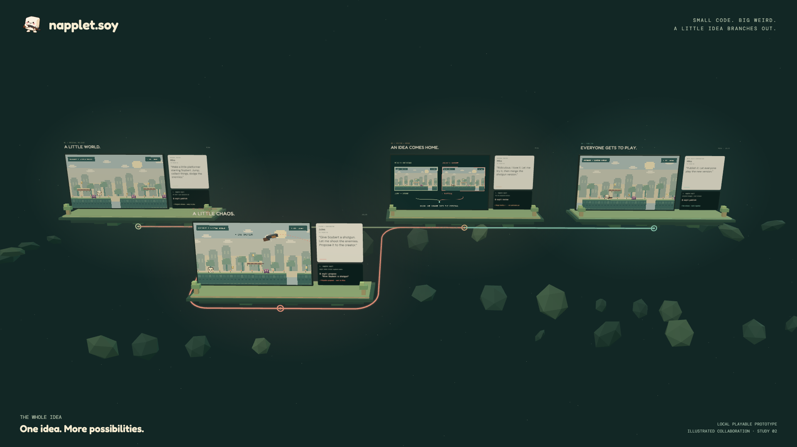
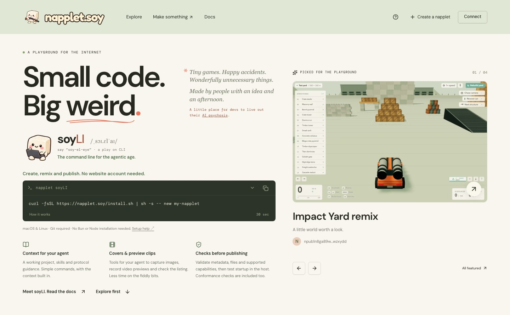
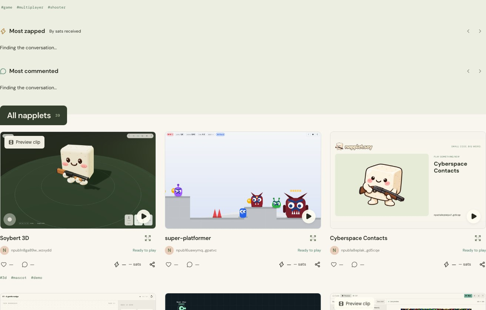
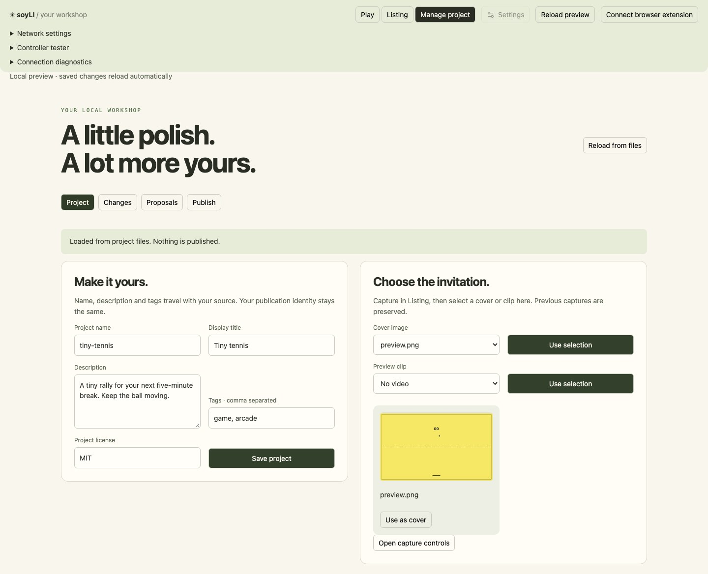

<p align="center">
  <a href="https://napplet.soy">
    
  </a>
</p>

<h1 align="center">napplet.soy</h1>

<p align="center"><strong>Small code. Big weird.</strong><br />Make a little app. Share it. Make it better together.</p>

<p align="center">
  <a href="https://napplet.soy">Play something</a> ·
  <a href="#make-your-first-napplet">Make something</a> ·
  <a href="#see-the-idea-in-30-seconds">Watch the film</a> ·
  <a href="https://napplet.soy/docs">soyLI docs</a> ·
  <a href="LICENSE">MIT licensed</a>
</p>

**napplet.soy is a playground for small games, useful tools and digital experiments.**
Build one with your favorite coding agent, publish it for anyone to try, then let
someone else remix it or propose an improvement.

**soyLI**—say *“soy-el-eye”*, a play on CLI—handles the project setup, previews,
checks, Git workflow and publishing. Your agent gets the context; you get to make
the interesting part. Git hosting and asset storage come with convenient defaults,
and you can choose your own providers.

**You don't need a website account to create, publish or contribute.**

## Make your first napplet

```sh
curl -fsSL https://napplet.soy/install.sh | sh -s -- new my-napplet
cd my-napplet
soyli dev
```

macOS or Linux, with Git installed. No separate Bun or Node installation required.
Follow the installer's PATH instruction if prompted, then open the preview URL it
prints. See [requirements and troubleshooting](docs/CLI.md#requirements-and-storage).

Open the project with your coding agent and describe what you want. For example:

> Make a tiny platformer with satisfying jumps, a few silly enemies and touch controls.

The project includes the maintained [Napplet boilerplate](https://github.com/napplet/boilerplate),
agent skills and soyLI's host/tooling guidance. In the local workshop, you can edit
the name and description, manage assets, capture screenshots and short clips, and
check the listing before publishing. Changes go back into your project files.

When it's ready, review your changes and publish:

```sh
soyli checkpoint "First playable version"
soyli publish
```

Publishing builds and checks the app, uploads its files and source, and signs its
public Nostr listing. The CLI helps create or connect a signing identity; preserve
its [recovery backup](docs/IDENTITY.md#cli-backups). **Published source and pushed
Git history are public by default.** Local editing stays local until you publish,
propose or push.

After installation, `soyli doctor` checks for a newer release and `soyli update`
installs it. Older CLIs without `update` can use the installer on the
[latest GitHub release](https://github.com/zeSchlausKwab/napplet-soy/releases/latest).
[Release and update details](docs/CLI-RELEASES.md).

## See the idea in 30 seconds

[](docs/media/napplet-soy-story.mp4)

**[▶ Watch or download the film](docs/media/napplet-soy-story.mp4)** · 30 seconds · MP4 · 3.1 MB

A staged Soybert story: make a platformer, give the remix a shotgun, propose the
change, merge it, and let everyone play the new version. Rendered from the same
interactive Three.js scene used on the [homepage](https://napplet.soy), with music
and game effects. [Scene source and rendering instructions](scripts/presentation/spatial/README.md).

## From an idea to a shared playground



| You want to… | napplet.soy and soyLI help you… |
| --- | --- |
| **Make something** | Start with source, agent skills, a build pipeline and a preview using the website's sandbox. |
| **Make it presentable** | Capture covers and short preview clips; review the title, description, tags and assets. |
| **Put it out there** | Check the build, publish signed listings, and upload source and assets to visible, configurable destinations. |
| **Make it better together** | Remix real Git history, propose a playable change, inspect the diff and merge locally. |
| **Find and enjoy things** | Browse by tags, play inline or fullscreen, view creator profiles, comment, like and send Lightning zaps. |
| **Build beyond a single player** | Use shared scoreboards, CVM matchmaking and WebRTC peer sessions through the supported host APIs. |

<details>
<summary><strong>A look inside the playground</strong></summary>



Screenshots show the public site as captured on 22 September 2026. Creations remain
credited to their authors; the collection changes as people publish.

</details>

## A workshop for you and your agent



`soyli dev` provides **Play**, **Listing** and **Manage project** views. The manager
also exposes Git changes, checkpoints, proposals and publishing. Use the GUI, ask
your agent to use the CLI, or edit the files directly—they work on the same project.
The screenshot uses a local example, without a publication or account.

[soyLI commands](docs/CLI.md) · [Assets](docs/ASSETS.md) ·
[Covers and clips](docs/PREVIEWS.md) · [Mobile guidance](docs/MOBILE.md)

## Remix first. Decide what to do with it later.

Like something? Take a copy and change it. You can publish your own version,
propose the improvement to its original author, or do both.

```sh
soyli remix 'NAPPLET_LINK' my-remix
cd my-remix
# Make your changes and try them in soyli dev.
soyli checkpoint "Give Soybert a shotgun"
soyli propose "Give Soybert a shotgun"
```

Replace `NAPPLET_LINK` with the napplet's share URL. For Git-backed creations,
remixing preserves history and the upstream relationship. Source/archive-only
creations can still be remixed, but cannot invent a Git upstream for proposals.

The original author opens their project and runs:

```sh
soyli review
```

The review workbench lists proposals, runs the original and proposed versions, and
shows the diff and discussion. Accepting merges locally. `soyli push` shares the
Git update; `soyli publish` releases the improved napplet. Ordinary Git and ngit
remain available. [Full collaboration workflow](docs/COLLABORATION.md).

## Open source. Open infrastructure.

This is a Nostr client and a set of creator tools. Napplets made here use the same
protocol as creations published elsewhere; extra presentation and source metadata
are optional. A name on this website is not the napplet's identity.

| Part | What it does |
| --- | --- |
| **Nostr + NIP-5D / NAPs** | Signed listings, portable identities and host capabilities. [Protocol contract](docs/PROTOCOL.md) and [compatibility matrix](docs/COMPATIBILITY.md). |
| **Blossom** | Content-addressed app files, assets and previews, retrieved directly with hash verification. [Asset workflow](docs/ASSETS.md). |
| **Git + NIP-34 / GRASP** | Public source history and ordinary Git repositories, with signed proposals and review. [Source hosting](docs/GRASP.md). |
| **ContextVM + WebRTC** | Shared scores, rooms, matchmaking and peer connections. [Creator guide](docs/BACKEND-CREATOR.md) and [service limits](docs/CONTEXTVM.md). |
| **Public app data** | Player-created tracks, puzzles and presets, shared as signed NIP-78 records. [Convention, helpers and current host limits](docs/SHARED-DATA.md). |

Run `soyli config` to see where a project's listings, files and source will go.
The defaults use `relay.napplet.soy`, `blossom.napplet.soy` and `git.napplet.soy`;
you can configure alternatives. The website also has **Network settings**.
[Direct protocol access and the remaining HTTP endpoints](docs/PROTOCOL-ACCESS.md).

The shell uses React, TanStack Start, Bun and Applesauce. The managed relay uses
Khatru with LMDB and Bleve. NAP support follows the project's pinned proposals;
see the [upstream review](docs/NAP-REVIEW.md) for exact contracts and known gaps.

### A few practical limits

Rust/Bevy creators can use the optional [Rust/WASM build recipe](docs/WASM.md)
with the same preview, publishing and collaboration commands. Its first profile
is single-threaded WebGL2 with embedded executable bytes; engine assets use the
normal host resource API. Players need no Rust installation. See the guide for
size limits and tested browsers; this source addition is not yet in a CLI release.

soyLI checks metadata, files, supported capabilities and startup in the host; it
doesn't certify gameplay, mobile usability or multiplayer performance. Test those
with real users and devices. Built-in video capture currently produces short,
silent landscape WebM clips; portrait presets are not yet implemented.

Authors can unpublish, republish and request deletion of hosted files with explicit
confirmation and per-service results. Independent copies cannot be recalled.
[Lifecycle controls](docs/LIFECYCLE.md) · [Runtime permissions and limits](docs/PUBLIC-RUNTIME.md).

## Work on the platform

Want to improve napplet.soy itself? This repository is the shell, soyLI and the
supporting services. Bug reports, docs, fixes and new ideas are welcome.
Making a napplet does **not** require checking out this repository.

<details>
<summary><strong>Local development and verification</strong></summary>

The platform toolchain needs Bun **1.3.11**, Node **18+** for PM2, Git, Go, Rust
**1.97.1** and a C compiler. The relay tooling selects Go **1.25.0** automatically.
Linux also needs `pkg-config` and OpenSSL development headers.

```sh
bun install --frozen-lockfile
bun run dev
```

Open [localhost:3000](http://localhost:3000). The local relay, Blossom, GRASP and
backend services start with the dev stack. Local examples are test fixtures;
they are not automatically published or featured on the public site.

```sh
bun run dev publicdev      # browse public publications in development
bun run check
bun run build
bun run test:browser       # with the web server running
```

Service changes also have focused `test:relay`, `test:blossom`, `test:grasp`,
`test:identity` and `test:publish` suites. Browser checks require the Playwright
browser; see the guides below for setup and toolchain details.

[Local development](docs/LOCAL-DEVELOPMENT.md) ·
[Public discovery in development](docs/PUBLIC-DEVELOPMENT.md) ·
[Web architecture](docs/WEB-ARCHITECTURE.md) ·
[CLI builds and releases](docs/CLI.md#building-and-releasing)

</details>

<details>
<summary><strong>Self-hosting and deployment</strong></summary>

Point the site, relay, Blossom and Git hostnames at a Debian/Ubuntu VPS with SSH
access and ports 80/443 available, then run:

```sh
bun run deploy --host root@your-vps --domain napplet.example
```

The deployment uses Caddy for HTTPS and PM2/systemd for services. It builds and
checks a candidate release before activation. Use `--shared-caddy` when sharing
an existing Caddy installation with other sites.

[Deployment and shipped-release evidence](docs/DEPLOYMENT.md) ·
[Backups and restoration](docs/RECOVERY.md) ·
[Relay](docs/RELAY.md) · [Blossom](docs/BLOSSOM.md) · [GRASP](docs/GRASP.md)

</details>

## Keep exploring

[Napplet](https://napplet.run) ·
[NAP specifications](https://github.com/napplet/naps) ·
[Official boilerplate](https://github.com/napplet/boilerplate) ·
[Identity and recovery](docs/IDENTITY.md) ·
[Community features](docs/COMMUNITY.md) ·
[Profiles](docs/PROFILES.md) ·
[Moderation](docs/MODERATION.md)

Platform code is [MIT licensed](LICENSE). Individual napplets and their assets
retain their own licenses and credits. [Media sources and reproduction](docs/media/README.md).
