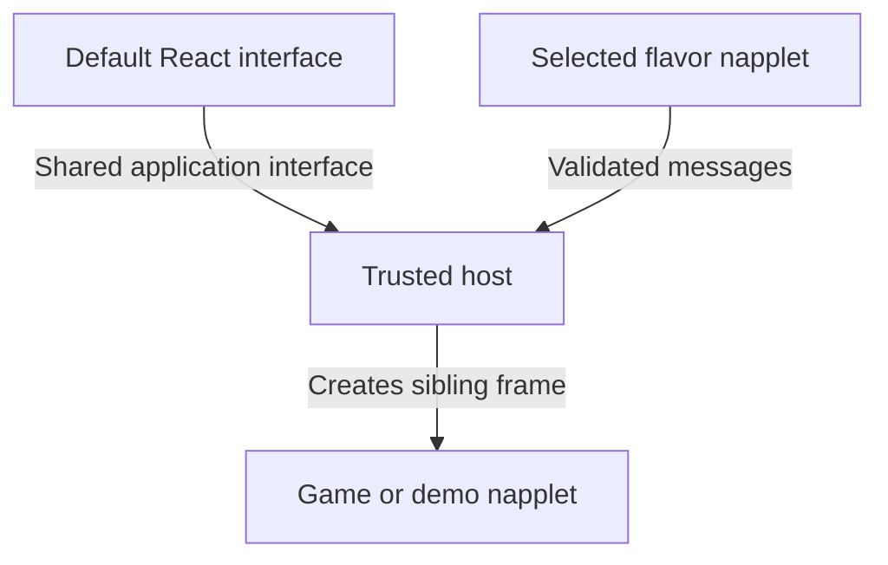

# Relay, media, flavors, and protocol alignment

2026-09-12. NIP-5D authority is confirmed by the user. The relay, capture workflow, and flavor interface below are recommended directions, not implemented features. This follow-up changes documentation only.

## Authoritative contracts

The [NIP-5D proposal at 24711d9](https://github.com/dskvr/nips/blob/24711d9c47bbdd07908bf1d52bf677d9cbc530f0/5D.md) is our authoritative web projection, regardless of upstream merge status. The [NAP registry at a040914](https://github.com/napplet/naps/tree/a040914b4bbd3a5cd8a14b0f316a723c968ebfb2) supplies capability contracts; NIP-5A supplies referenced manifest rules. Record these revisions together and review upstream changes deliberately. An SDK or another client is implementation evidence, not authority to override the contract.

The registry currently contains SHELL, IDENTITY, THEME, INC, and INTENT. Our other domains use pinned upstream implementation bindings; their exact operation contracts need a conformance inventory. The website uses @napplet/shim 0.30.0 with nap/core 0.32.0 and supplements it with the mandatory SHELL handshake.

## Relay

Recommend a small Go application built on [Khatru](https://pkg.go.dev/fiatjaf.com/nostr/khatru), with LMDB retaining signed events and Bleve as a rebuildable search projection. Keep Bun for the website and Applesauce for Nostr clients. Khatru supplies the relay framework; our application wires storage and operator policy. GRASP remains the Git service with its own protocol responsibilities.

Inspected candidate: `fiatjaf.com/nostr@v0.0.0-20260902034142-316ef6591fa2`, commit `316ef6591fa2f1d4247ce949a9361a44dcfe1f95`. This is not yet a tested deployment pin. Its [Bleve adapter](https://pkg.go.dev/fiatjaf.com/nostr@v0.0.0-20260902034142-316ef6591fa2/eventstore/bleve) indexes title/description tags, but default `IndexableKinds` omits napplet kinds. Configure 35129/15129/5129 and relevant supporting kinds explicitly. It needs a raw event store and configured languages.

Expose text search through [NIP-50](https://github.com/nostr-protocol/nips/blob/master/50.md), and topics through ordinary `#t` filters. Other clients must be able to make the same queries. The web projection adds availability, names, moderation, and curation; it does not replace signed events. Search covers retained/indexed events, not the whole Nostr network.

Acceptance checks before adoption:

- Search titles/descriptions when content is empty, including quoted phrases. The inspected adapter's exact-phrase post-check uses raw content even though indexing includes metadata; verify/adapt this behavior.
- Combine text with kind, author, time, and topic filters. Refill result pages after filtering candidates; a bounded candidate set can otherwise underfill a page.
- Replacement, deletion, expiration, crash recovery, and index rebuild must keep results consistent with retained events. An indexing callback alone is not a durability strategy.
- Run the same pinned service build locally and on the VPS, varying endpoints, credentials, and volumes. Keep Caddy/PM2 for the Bun app. Test protocol operations and recovery, not just open ports.

## Previews, screenshots, and video

Current behavior is documented in [PREVIEWS.md](PREVIEWS.md): authored SVG posters for examples; signed descriptor screenshots/pictures/icons for imported napplets; generated graphics when no usable image exists. Downloaded images become bounded cached PNGs. OG cards are generated 1200 × 630 images containing the selected artwork and metadata. No napplet executes during this generation. Animated input currently becomes its first frame; no video previews or automatic screenshots exist.

Recommended capture workflow:

1. Accept an explicit cover immediately. Offer an optional CLI capture command which opens the exact build in the same host runtime and captures it through browser automation. Do not make a browser download or failed capture block minimal publication.
2. Use a disposable guest session. Allow a chosen frame or bounded interaction recipe. Record artifact hash, runtime profile, viewport, and capture settings; rendering itself is not guaranteed deterministic.
3. Upload covers separately to Blossom. The creator signs the linked descriptor through the supported NIP-89/Zapstore conventions. Media are not playable manifest paths, so changing a cover does not alter the executable aggregate.
4. Later, an isolated operator worker can capture missing covers asynchronously, with no credentials, no writes, bounded networking and process resources. These are operator-generated presentation data. It cannot silently update an author's signed descriptor; portable author-endorsed metadata requires the author's signed link/update.

Video should be a short, bounded separate artifact with a static poster, validated/transcoded derivatives, lazy loading, reduced-motion handling, and only one active preview. Keep a PNG for OG and do not wait for video encoding before publication. [NIP-94](https://github.com/nostr-protocol/nips/blob/master/94.md) describes files; [NIP-92](https://github.com/nostr-protocol/nips/blob/master/92.md) describes media attached to content URLs. Neither alone defines “this video previews this napplet.” Specify that descriptor association and test it with another client before claiming interoperability; do not invent a mandatory napplet video tag.

## Flavors

A flavor is an ordinary signed, versioned napplet that renders a selectable interface. It can change layout, navigation, and interactions; a theme changes appearance tokens. Flavors use the same publish/remix/source/preview pipeline as other creations.

Retain a minimal trusted host for routing, account connection, signing confirmations, verification, permissions, player sessions, and a return-to-default control. Flavors receive neither a signer nor another napplet's DOM. They can still draw misleading content inside their area; actual permission prompts must identify the caller and remain outside that area.

The flavor and playable content are sibling frames controlled by the host. Initially, opening a creation uses the canonical host route or player overlay. Custom player placement can follow through bounded slots; the flavor never embeds the player's frame. This introduces limited host-managed composition for the website interface. Ordinary games remain self-contained and need no inter-napplet behavior.

Keep the first application interface small: query/resolve the catalog, open a portable napplet identity, observe route changes, and store that flavor's own preferences. Both default React UI and the future message adapter should use the same application module. It returns verified, normalized data and owns paging, resolution, and policy; it exposes no raw database or unrestricted RPC access.

Use existing NAP semantics where they fit: theme, identity, relay/outbox reads, and intent dispatch. There is no complete standardized catalog-and-layout interface in the current registry. Additional operations/conventions must be explicitly versioned client extensions, scoped to flavors, and proposed upstream where useful. Do not redefine NAP-SHELL or treat a named service string as a transport specification. Ordinary napplets must work without these extensions.

Rollout: first separate queries/player lifecycle from React presentation while retaining the default UI. Then offer theme tokens and one real second layout to test the interface. A user explicitly selects a flavor; persist its exact manifest/release locally, with optional account sync later. Notify about executable updates and expanded permissions rather than silently changing the selected interface.

Canonical routes keep trusted SSR and OG output. Personalized flavor code runs client-side; do not execute arbitrary flavors during SSR. A visible host reset and a recovery route/query must work before flavor loading, including after a crash.

## Browser loading

The website already runs napplets on the viewer's device: verify the signed manifest and bytes, inject the runtime, then execute in an opaque `srcdoc` iframe. The server supplies cached artifacts and proxies some resources; it does not run games remotely.

Inline gallery playback needs presentation/lifecycle work, not a new execution architecture. Start with click-to-play, one active content player, teardown when leaving the active view, and preservation of the instance when expanding fullscreen. Hiding an iframe is not a reliable pause for arbitrary code. Add viewport-driven loading after measuring CPU/GPU, memory, battery, and bandwidth costs.

Direct browser-to-relay/Blossom delivery can run in the trusted host with the same verification, cancellation, and quotas. Providers must be reachable and allow [CORS](https://developer.mozilla.org/en-US/docs/Web/HTTP/Guides/CORS) where required. Keep the gateway as accelerator/fallback and the server index for SSR. Navigating directly to remote HTML in `iframe.src` is not a substitute for the verified injection path.

## Focused contract audit

This is a source review of selected contracts, not an exhaustive conformance result.

| Area | Current code | Assessment |
| --- | --- | --- |
| Website loading | Correct napplet kinds, single `/index.html`, signatures/hashes, opaque `srcdoc`, source-bound messages | Core path follows the selected design. Single-file packaging and isolation are requirements, not deviations. |
| Unknown messages | `packages/runtime/src/host.ts` sends errors for some unknown domains/actions carrying an ID | Actual mismatch: silently ignore unknown types, while retaining policy errors for recognized operations. |
| CLI preview | `apps/cli/templates/dev.template` uses `src=/preview`, an empty namespace, and no host/SHELL | Actual contract/parity gap: use the website's verified `srcdoc`, shim, handshake, and host module. |
| Identity relay list | `packages/nostr/src/playback.ts` reports configured host relays | Semantic mismatch with NAP-IDENTITY's user NIP-65 list; separate user preferences from effective relay policy. |
| Identity changes | Account switching restarts frames; no `identity.changed` push | Missing notification behavior. Preserve account isolation while notifying surviving sessions and cancelling old work. |
| Optional domains | INC/INTENT/CVM and other domains absent; extended identity/fs operations missing | Coverage gaps. Absent optional domains alone do not violate the web projection; advertised domains still need operation-level conformance. |
| Writes/resources | Known writes denied; bounded HTTPS/MIME/byte/time/relay policy | Deliberate host restrictions. Verify denial/error semantics rather than advertising complete operation support. |
| Theme | Fixed theme with required color fields | Allowed by NAP-THEME; add push updates when theme switching exists. |
| Source/discovery | HTTPS source links only; bounded startup catalog and no arbitrary uncached naddr resolution | Missing `nostr://` source resolution and general on-demand discovery. |
| Publication | Fixtures remain unpublished; CLI publication and independent-client acceptance absent | Incomplete authoring path; prove the ordinary relay/Blossom round trip in another host. |

Repair known web/CLI contract gaps first, then integrate the local Khatru/LMDB/Bleve, Blossom, and GRASP publish path. Preserve the flavor interface in that design; defer arbitrary flavor execution and video workers until the creation loop works.
