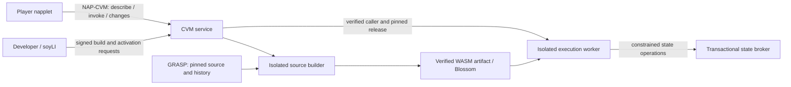

# Dynamic CVM backends: source-built releases and persistent worlds

**Design draft, 2026-09-25. The broader design below is not a deployed service.**
The [local implementation guide](../../DYNAMIC-BACKENDS.md) records what now works,
its exact profile and remaining rollout gates. The first profile is TypeScript
transpiled into JavaScript running in QuickJS WASM, not Extism or a standalone
WASM artifact per handler. Production contracts live in
`packages/dynamic-backends/src/contracts.ts`; the schemas below remain design
exploration and are not the wire contract. Whether to propose a CVM CEP is deferred.
The accompanying [executable schemas](schemas.ts) describe proposed contracts.
Names, budgets and runtime choices still need implementation evidence. Existing
scores, rooms and NAP-CVM behavior are documented in [CONTEXTVM](../../CONTEXTVM.md).

## The source guarantee

For a public backend hosted by napplet.soy, **the provider builds the release from
its declared immutable public source**. A developer-supplied WASM file alone does
not qualify. Local builds remain useful for development and preview.

These are separate guarantees:

| Guarantee                      | Mechanism                                                                                       | What it does not establish                                      |
| ------------------------------ | ----------------------------------------------------------------------------------------------- | --------------------------------------------------------------- |
| Containment                    | Restricted WASM imports, instance-scoped host functions, process isolation and resource budgets | That game rules are fair or match a particular repository       |
| Source-to-artifact provenance  | Provider-controlled build of pinned source; signed receipt binding inputs and output            | That the provider honestly runs that artifact for every request |
| Independent build verification | Published recipe, pinned dependencies/toolchain and reproducible output                         | Honest operation, sound game rules or absence of bugs           |
| Authoritative mutations        | Server checks permissions and game rules and commits atomically                                 | Trustworthy client movement or a complete anti-cheat system     |

[Extism explicitly supports HTTP and filesystem capabilities](https://extism.org/docs/concepts/manifest/).
If selected, configure `allowed_hosts: []`, no filesystem mounts/WASI access,
no credentials in plugin configuration, and only reviewed host functions.
Do not rely on omitted/null networking settings. A worker also needs OS-level
egress denial, memory/fuel/deadline limits and limits on host calls and outputs.
Database access goes through the state broker, never a database path or raw SQL.

Compilation is another untrusted workload, in a separate builder without service
keys or player data. Source acquisition is a bounded, validated stage; compilation
runs offline with a fixed recipe and pinned inputs. Do not execute a project's
arbitrary package scripts in the service process. Symlinks, submodules, redirects,
private-network destinations, archive expansion and dependency downloads all need
explicit admission rules. The provider issues receipts outside the builder.

This is build provenance in the [SLSA sense](https://slsa.dev/spec/v1.2/provenance),
not a claim of SLSA certification. A provider signature means “this provider
attests to this build.” It cannot prove an honest provider. Publish enough input
material for [independent reproducible builds](https://reproducible-builds.org/docs/definition/);
do not label them reproducible until independent builds actually match.

## Objects and responsibilities

- **Module / slot:** an author-qualified napplet plus a backend name, such as
  `{napplet: naddr, name: "worlds"}`. Normalize the NIP-19 address; relay hints are
  locators and must not create separate namespaces. Ownership is verified, not
  granted to whoever first registers a name.
- **Release:** immutable code, operation schemas, state schemas and execution
  policy. Public source and build receipts are inspectable.
- **Instance:** durable application state pinned to one release. A MiniCraft
  world is an instance. It remains when every player leaves or a worker restarts.
- **Record:** a bounded object within an instance: world metadata, a chunk,
  membership or inventory. A transaction may touch several records in that
  instance; it cannot cross into another world or another tenant.

The provider operator sets admission and resource policies. The developer controls
module releases. A player can own a world and invite other players without being
the module developer. Publishing a remix creates an independent module; it does
not confer access to the original's worlds. Public source does not imply public
player data. Storage, logs, exports and updates must all respect read permissions.

## Who talks to what



These are ordinary MCP tools over the existing encrypted NAP-CVM connection.
They add no custom browser namespace, REST proxy or new playback requirement.
Other clients can use the same contract. No special soyLI provenance is needed
to play an app or call the service; public module builds obey the same provider
policy regardless of which client submits them.

### Developer management contract

Proposed tool names map to `platform` in `schemas.ts`:

| Tool                                                   | Inputs / effect                                                                                                                                            |
| ------------------------------------------------------ | ---------------------------------------------------------------------------------------------------------------------------------------------------------- |
| `soy_backend_build`                                    | Module, immutable source, fixed build profile, request ID and scoped creator proof. Queues a build and immediately returns its ID.                         |
| `soy_backend_build_status`                             | Build ID. Returns pending/building/failed/ready, sanitized diagnostics and, when ready, the release and signed receipt. No player state or private logs.   |
| `soy_backend_activate`                                 | Module, release and expected current release plus proof. Atomically changes the default for **new** worlds.                                                |
| `soy_backend_describe`                                 | Module and optional exact release. Returns active/disabled status, immutable schemas, policy limits, source and receipt references.                        |
| `soy_backend_disable`                                  | Module and expected module revision plus proof. Stops new invocations while preserving state.                                                              |
| `soy_backend_delete_release`                           | Module and release plus proof. Refuses active or instance-referenced releases. Retains a provenance tombstone.                                             |
| `soy_backend_purge_plan` / `soy_backend_purge_confirm` | Authorized instance purge, with a plan digest and explicit confirmation. States which live data will be removed and which backups/public artifacts remain. |

Updating code means building another release. Activation never silently converts
existing state. A later migration must explicitly specify old/new releases,
validate new state, protect against concurrent writes and provide backup/restore.
Changing a default is not permission to run new developer code over old private
worlds; instance owners must opt in. Rollback only works with compatible state or
an explicit restore. Removing code cannot erase public Git or Blossom copies.

The committed backend manifest is deliberately small:

```json
{
  "format": "soy.backend/1",
  "name": "worlds",
  "buildProfile": "soy-ts-wasm-v1",
  "entry": "backend/worlds.ts",
  "schemas": "backend/worlds.schema.json",
  "stateVersion": 1,
  "abi": "soy-handler-v1"
}
```

The names above are proposed. `soy-ts-wasm-v1` would mean a fixed provider build
recipe, not arbitrary Node/npm compatibility. Extism's
[JS PDK](https://github.com/extism/js-pdk) is a candidate: it embeds a JavaScript
engine in WASM. The runtime and build reproducibility still require a measured
spike before selecting the implementation.

The build request identifies a NIP-34 repository, HTTPS clone locator, **full Git
commit hash**, manifest path and module. Source, schema definitions and handler
code live at that same commit. The provider checks the maintainer proof and fetch
policy, builds, validates imports/exports and schema limits, and binds the output.
Long builds use status polling rather than a long-lived MCP request.

The signed build receipt binds:

```text
provider + module + release
repository + commit + source tree digest + manifest digest
build profile + builder image + toolchain + dependency-set digests
operation/state schema digest + handler ABI + runtime-policy digest
WASM SHA-256 + byte length + artifact locator + build time
```

`buildReceipt` is the receipt payload schema, not its signature verifier. The
signature envelope, canonical tree/digest encoding and release-ID encoding need
wire fixtures before implementation. Release identity must cover code, schemas,
source and policy; exclude mutable locators and build timestamps so a repeat build
can identify the same release. Verify the artifact hash before loading. An
invocation pins its release and responses identify it; clients must reject a
surprise substitution. No automatic stateful-provider fallback.

### Identity and authorization

The current CVM actor is a transport public key scoped to a tab/app/viewer. It is
**not** verified evidence of the player's durable Nostr account. Do not accept
`actor`, `owner` or `role` claims in ordinary command input.

For account ownership, `soy_backend_session_challenge` and
`soy_backend_session_bind` establish a short-lived binding. The signed challenge
must bind the domain/version, provider, normalized module, transport key, account,
nonce, allowed scope and expiry. Verify it once, record nonce consumption, then
require that same authenticated transport for the returned session ID. Session
IDs are locators, not transferable bearer tokens. Expiry, revocation and a changed
account must invalidate the binding; the shell must not silently switch identities.

The shell displays scoped consent before requesting a proof from the selected
signer. It may remember an approved connection within that scope. The backend
then checks each action without a signature prompt for every block. New devices
bind their own session to the same account. Private keys never enter the napplet.

Management proofs additionally bind the exact operation and canonical arguments,
request ID and expiry. A reusable proof cannot authorize a different build or purge.
The draft reuses the existing service's **unpublished** signed kind-1 proof shape;
this is an application-specific convention, not a new Nostr standard or public note.
Proof verification and replay protection are not implemented by the Zod schemas.

ContextVM's dynamic allowlist can restrict admission, but per-module and per-world
authorization belongs inside the service. `tools/list` visibility is not a
security boundary. A copied client or an app-hash claim does not prove honest game
code; assume an authenticated player can send arbitrary valid requests.

## MiniCraft schema example

These are game choices, not provider-wide restrictions. The example uses finite
256 × 128 × 256 worlds divided into 8 × 8 × 8 chunks. Missing chunks are generated
deterministically from the seed; only changed chunks need durable storage.

| Record    | Fields                                                                                                                                                    |
| --------- | --------------------------------------------------------------------------------------------------------------------------------------------------------- |
| World     | `id`, `name`, verified `owner`, `seed`, `mode`, read/build policy, guest policy, pinned `release`, `schemaVersion`, `revision`, dimensions and chunk size |
| Chunk     | Chunk coordinates, `revision`, `schemaVersion`, exactly 512 palette indexes                                                                               |
| Member    | Verified Nostr principal, `builder` or `viewer`, membership revision                                                                                      |
| Inventory | Verified principal, revision, bounded counts by block type                                                                                                |

Palette indexes are `air, stone, dirt, grass, wood, glass, sand, water` in that
order. A chunk index is `x + 8 * (z + 8 * y)` using local coordinates. Global x/z
are integers 0–255 and y is 0–127. Chunk coordinates are x/z 0–31 and y 0–15.
These bounds, closed objects and output schemas are executable in `schemas.ts`.

The developer defines these operations; the provider exposes them through
`soy_backend_describe` and `soy_backend_invoke`:

| Operation         | Player supplies                                               | Backend checks / returns                                                                                |
| ----------------- | ------------------------------------------------------------- | ------------------------------------------------------------------------------------------------------- |
| `createWorld`     | Name, seed, creative/survival, visibility and building policy | Verified account and creation quota. Assigns owner and new instance ID.                                 |
| `readWorld`       | World target                                                  | Read permission; world metadata.                                                                        |
| `readChunks`      | 1–8 chunk coordinates                                         | Read permission; bounded chunks from a consistent revision.                                             |
| `placeBlock`      | Position, non-air block, expected chunk revision              | Build permission, bounds, empty cell and, in survival, inventory. Atomically edits chunk and inventory. |
| `removeBlock`     | Position, expected chunk revision                             | Build permission and removable block. Atomically removes it and credits inventory when applicable.      |
| `readMyInventory` | World target                                                  | Verified account and membership/read policy; only this player's inventory.                              |
| `setMember`       | Principal, builder/viewer/null, expected membership revision  | World owner only. `null` removes membership; cannot overwrite the owner.                                |

Public worlds allow guest reads; members-only worlds require membership. A world
owner can always build. Other account players can build if they are builders or
the world allows everyone; explicitly listed viewers remain read-only. Guests
may build only in public creative worlds that allow everyone and opt in to
guest edits. Survival requires account identity. Creation rejects contradictory
policies. These are handler rules beyond structural validation.

This example validates building and inventory, not character distance, movement,
combat or a competitive survival economy. Those require explicit authoritative
rules and additional state. It is not a claim of comprehensive anti-cheat.

### What the player sends

The existing SDK transports the proposed service call. Hashes/IDs below are
abbreviated placeholders; the exact validators require their complete values.

```ts
import { cvm } from '@napplet/sdk';

const reply = await cvm.callTool(provider, 'soy_backend_invoke', {
  target: {
    type: 'instance',
    module: { napplet: naddr, name: 'worlds' },
    release: pinnedReleaseHash,
    instance: worldId,
  },
  operation: 'placeBlock',
  requestId: crypto.randomUUID(), // Retain this exact request for timeout retries.
  expiresAt: Math.floor(Date.now() / 1000) + 120,
  session: boundAccountSession,
  input: { x: 12, y: 4, z: 18, block: 'stone', expectedChunkRevision: 42 },
});
```

Successful `structuredContent`:

```json
{
  "ok": true,
  "release": "<pinned release hash>",
  "requestId": "<same request UUID>",
  "revision": 108,
  "result": { "revision": 108, "chunkRevision": 43, "inventoryRevision": 7 }
}
```

Creating a world uses the same envelope with `target.type: "module"`, no instance,
`operation: "createWorld"` and its declared input. The creator is the verified
player in context, not the developer and not a caller-provided `owner` property.

At the worker boundary, the handler receives verified context separately from
untrusted input: account/guest principal, transport actor, instance, release and
request time. Its state interface supports bounded reads and buffered writes
within one transaction. A handler cannot choose another actor, open another
world's database or call a network service. Game code enforces its policy; the
broker additionally enforces namespace isolation, shape and resource limits.

The service verifies input against the selected operation schema, executes the
handler, validates output and every changed record, then atomically commits all
writes, a deduplication receipt and a change record. Any error, trap, budget
exhaustion or schema failure rolls the whole transaction back. Queries cannot
write. Read/write-set versions prevent races even when a developer omits a check.

If two players modify chunk 42 concurrently, one commits and the other gets
`CONFLICT`; its inventory stays unchanged. Refetch and explicitly retry the intent
with a new request ID. A network timeout instead retries the **same** request ID
and payload, returning the committed result without charging inventory again.
IDs are scoped to verified actor + module + instance; changed payloads under the
same ID are rejected. Expiry is part of that payload. Bound the accepted expiry
horizon and keep deduplication receipts until it passes; expired requests fail
even after receipt collection. Never silently turn an expired retry into a new edit.

### Synchronization, retention and errors

`soy_backend_changes({target, after, limit, session?})` returns authorized changes
after an instance revision with a continuation cursor and pinned release. It must
filter private records. Pagination advances a scan cursor even over hidden events,
so a subscriber cannot stall on another player's inventory update. Catch-up and
initial chunk snapshots need a consistent revision watermark; retained logs repair
the gap. An expired cursor returns `RESYNC_REQUIRED`, leading to fresh snapshots.

Push notifications may wake clients, but correctness cannot depend on receiving
every notification. Start with bounded pull/catch-up, then measure whether streams
help. CEP-41 alone is not durable replay or backpressure. NAP-WEBRTC can carry
transient positions and cursors; persistent edits are accepted by the CVM service.
Do not promise a low-latency authoritative shooter or full world simulation here.

Errors include stable codes, safe messages, retry guidance, request identity and
release where known. The draft covers forbidden/stale/invalid/quota/disabled and
retry-window failures. Failures before release resolution need an outer service
error. Runtime details go into sanitized operator diagnostics, not player replies.
Preserve useful build/compiler causes through the CLI's existing diagnostics
contract. A timeout must report uncertain completion and keep the original request.

## Schema identity, verification and implementation gates

The outer invoke tool's CEP-15 hash identifies its generic envelope. The module's
own operation/state schema digest and release identify the actual game contract.
Schema changes require new immutable releases. Describe returns input/output/state
schemas and policy limits for that release, not an unversioned mutable schema URL.

Admit only a bounded JSON Schema subset: closed records, primitives, enums, arrays
and explicit bounds. No remote references or executable validators. Enforce depth,
node count and UTF-8 bytes before walking inputs/schemas. The generic JSON envelope
in the draft does not itself implement these quotas or game authorization.

`jsonSchemaCatalog()` exports the executable shapes as JSON Schema 2020-12 for
review. It is not a production schema-admission engine. Scope/effect/identity
metadata describes intended execution policy and must also be enforced at runtime.

Before exposing registration on the public provider, verify the builder and worker
against malicious imports, infinite loops, memory/IO abuse, cross-instance access,
forged identities, retry races and crash recovery. The first vertical acceptance
case is two independent clients editing one world, leaving, restarting the service
and recovering that world. Check real mobile/reconnect behavior as well as local
browser automation. Integration must preserve isolated soyLI preview data, public
source/history and safe remix/proposal review without production write access.

No new runtime dependency or protocol pin is selected by this draft. Compatibility:
NAP-CVM PR 31 remains open at `ad68a938236e9230324e377cd005008a315ff402`; installed
ContextVM SDK 0.13.16, MCP 1.30.0 and shim 0.30.0 remain unchanged. ContextVM docs
were reviewed at `745daa7bf2600450776897d2b47a920b4d7cc801`, including
[dynamic authorization](https://github.com/ContextVM/contextvm-docs/blob/745daa7bf2600450776897d2b47a920b4d7cc801/src/content/docs/reference/ts-sdk/transports/nostr-server-transport.md)
and [CEP-41](https://github.com/ContextVM/contextvm-docs/blob/745daa7bf2600450776897d2b47a920b4d7cc801/src/content/docs/reference/ceps/cep-41.md).
